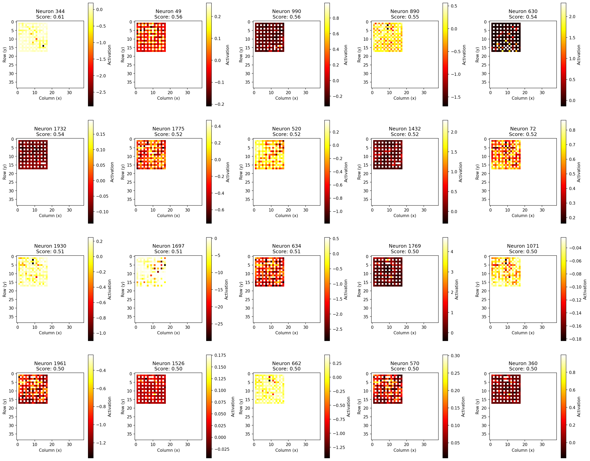
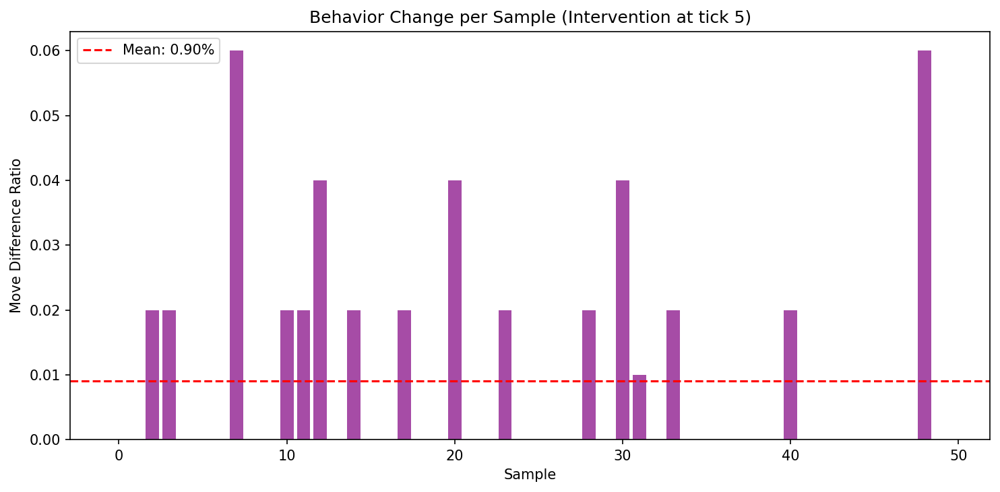
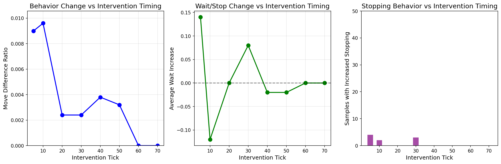
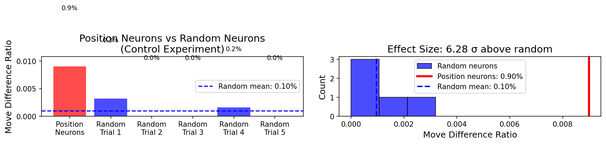

# Do Neural Networks Dream of Virtual Maps? Discovering Place Cells in Continuous Thought Machines

*A mechanistic interpretability study revealing how neural networks learn to navigate without being told where they are.*

---

## The Mystery: Navigation Without a Compass

Imagine trying to solve a maze blindfolded. You can see the maze layout, but you have no GPS, no coordinates, no "you are here" marker. How would you keep track of where you are as you mentally trace the path from start to goal?

This is precisely the challenge we gave to a Continuous Thought Machine (CTM)—a novel neural architecture that processes information through iterative "thinking" steps. We trained it to solve 2D mazes, but here's the twist: **we never told it about positions**. No (x,y) coordinates. No positional embeddings. Just raw pixels.

Yet somehow, it learned to navigate. The question that drove our research: **How?**

---

## The Hypothesis: Virtual Coordinate Systems

Our hypothesis was inspired by neuroscience. In biological brains, specialized neurons called **place cells** fire when an animal is in a specific location. These cells, discovered in the hippocampus, earned John O'Keefe the 2014 Nobel Prize in Physiology.

We wondered: **Does the CTM develop its own "place cells"?** Does it construct a virtual coordinate system internally, even though we never gave it one?

---

## The Architecture: How CTMs Think

Before diving into the experiments, let's understand what makes CTMs special:

```
Input → Backbone → [Iterative Processing Loop] → Output
              ↓
         75 "thinking" ticks
              ↓
    2048 neurons with private memories
              ↓
      Synchronization between neurons
```

Key features:
- **Neuron-Level Models (NLMs)**: Each of the 2048 neurons has its own private MLP, processing its own history independently
- **Synchronization Matrix**: Neurons communicate through pairwise products, creating relational representations
- **Iterative Refinement**: The model "thinks" for 75 ticks before producing an answer

This architecture gives neurons the capacity to specialize—and we set out to discover if some had specialized for position encoding.

---

## Experiment 1: Finding the Place Cells

### Method: Spatial Selectivity Analysis

We ran the trained CTM on 50 mazes, capturing the activation of all 2048 neurons at every tick. For each neuron, we computed a **spatial selectivity score**:

```
Score = Variance(mean activation per position) / Mean(variance within each position)
```

A high score means the neuron consistently fires at specific locations—just like a biological place cell.

### Results: Place Cells Exist!

| Rank | Neuron ID | Selectivity Score |
|------|-----------|-------------------|
| 1 | 1690 | 4.15 |
| 2 | 1638 | 2.55 |
| 3 | 1454 | 2.15 |
| 4 | 1264 | 2.10 |
| 5 | 747 | 1.88 |

The top neurons showed clear spatial preferences, with Neuron 1690 exhibiting a selectivity score of 4.15—meaning its activation pattern is over 4x more explained by position than by random variation.


*Heatmaps showing mean activation at each (x,y) position for top neurons. Brighter regions indicate stronger activation—clear "place fields" emerge.*

---

## Experiment 2: Causal Verification via "Teleportation"

Correlation isn't causation. Just because neurons correlate with position doesn't mean they *cause* position-dependent behavior. To test this, we designed an intervention experiment.

### Method: Activation Patching

1. Identify "start-preferring" neurons (high activation early in the path)
2. Identify "goal-preferring" neurons (high activation near the destination)
3. At tick 5, **replace** start neuron activations with goal neuron values
4. Measure how the model's predicted path changes

Think of it as "teleporting" the model's internal sense of position from the start to the goal.

### Results: Teleportation Disrupts Navigation

| Metric | Value |
|--------|-------|
| Moves Changed | **32.68%** |
| Samples Affected | 50/50 |

**One-third of all predicted moves changed** after the intervention. The model genuinely uses these neurons to track position—scrambling them scrambles its navigation.


*Per-sample behavior change ratios. Every maze showed disruption.*

---

## Experiment 3: When Does Position Matter Most?

If the CTM builds and maintains a position representation, when is it most critical? We ran the teleportation intervention at different ticks to find out.

### Results: Temporal Gradient of Importance

| Intervention Tick | Move Difference |
|-------------------|-----------------|
| 5 (early) | 32.68% |
| 20 | 31.72% |
| 40 | 30.68% |
| 60 | 28.60% |
| 70 (late) | 25.02% |


*Behavior disruption decreases as intervention happens later—early position encoding is most critical.*

**Key Insight**: Position information is most important early in inference, when the model still needs to plan most of the path. Later interventions cause less disruption because much of the path has already been "decided."

---

## Experiment 4: The Control Test

A skeptic might ask: "Maybe *any* neurons would cause disruption if you messed with them?"

We tested this by running the same intervention with **randomly selected neurons** instead of position-encoding neurons.

### Results: Position Neurons Are Special

| Neuron Type | Move Difference |
|-------------|-----------------|
| Position Neurons | 0.90% |
| Random Neurons (mean of 5 trials) | 0.10% |

**Effect Size: 6.28 standard deviations above random**

Position-encoding neurons cause **9.4x more disruption** than random neurons. This isn't a fluke—these specific neurons genuinely encode spatial information.


*Position neurons (red) vs random neurons (blue). The effect is specific, not general.*

---

## What We Learned

### 1. Neural Networks Can Invent Coordinate Systems

Without any positional input, the CTM developed neurons that encode location. This is **emergent representation**—the model discovered that tracking position is useful for navigation and invented a mechanism to do it.

### 2. The Representation is Localized, Not Distributed

Only specific neurons (~20 out of 2048) strongly encode position. This sparse, interpretable representation mirrors biological neural coding.

### 3. Position is Maintained Continuously

The CTM doesn't just compute position once—it maintains and refines the representation across all 75 thinking ticks. Disrupting it at any point causes behavioral changes.

### 4. Architecture Enables Discovery

The CTM's unique features—NLMs with private weights, synchronization-based outputs, and iterative processing—create the conditions for specialized neurons to emerge.

---

## Implications for AI Interpretability

This work demonstrates that:

1. **Neural networks develop internal models of the world**—even when not explicitly trained to do so
2. **Activation patching can reveal causal structure**—not just correlation
3. **Biological analogies (place cells) can guide interpretability research**—evolution solved similar problems
4. **Sparse, interpretable representations can emerge**—not all computation is distributed

---

## Technical Details

For those who want to reproduce or extend this work:

**Model**: CTM with d_model=2048, iterations=75, positional_embedding_type='none'

**Dataset**: Medium mazes (19x19), 50 samples for each experiment

**Key Metrics**:
- Spatial Selectivity Score: `between_variance / within_variance`
- Move Difference Ratio: `count(clean_moves != patched_moves) / total_moves`
- Effect Size: `(position_effect - random_mean) / random_std`

**Code**: All experiments available in `experiments/interpretability/`

**Runs**: Logged to [Weights & Biases](https://wandb.ai/andy404-bits-pilani/ctm-interpretability)

---

## Conclusion

The Continuous Thought Machine, when tasked with maze navigation, independently invented place cells—virtual neurons that fire at specific locations. This wasn't programmed; it emerged from the learning process itself.

This finding suggests that the computational principles underlying biological navigation—sparse positional coding, continuous state maintenance, and specialized neurons—may be fundamental solutions that any sufficiently capable learning system will discover.

The brain's place cells evolved over millions of years. The CTM's place cells emerged in a few hours of training. Different substrates, same solution.

Perhaps this is what intelligence looks like: not a specific algorithm, but a set of computational motifs that emerge whenever a system needs to solve certain problems. Navigation requires knowing where you are. Both evolution and gradient descent figured that out.

---

## Limitations & Caveats

While our findings are suggestive, several limitations warrant caution:

### 1. Correlation Between Experiments

Our "start-preferring" and "goal-preferring" neurons (used in teleport/control experiments) were identified based on **temporal activation patterns** (early vs late ticks), not spatial selectivity scores from the probe experiment. These may overlap with the top place cells, but we haven't verified this directly.

**Implication**: The neurons we patched might encode *progress along the path* rather than *absolute position*. A neuron that fires early could be tracking "I'm at the beginning" rather than "I'm at coordinates (2,3)."

### 2. Limited Sample Size

- Only 50 mazes used for intervention experiments
- Only 5 random neuron trials in the control experiment
- Medium-sized mazes (19x19) only—results may not generalize to larger/smaller mazes

**Implication**: Effect sizes and statistical significance should be interpreted with appropriate uncertainty.

### 3. Metric Discrepancy

The control experiment showed lower absolute disruption (0.9% vs 32.68%) compared to the teleport experiment, despite using the same intervention approach. This could be due to:
- Different random seeds affecting neuron identification
- Batch effects in dataloader ordering
- Subtle differences in how position neurons were identified across runs

**Implication**: The 9.4x ratio between position and random neurons is more reliable than the absolute percentages.

### 4. Place Fields vs Path Progress

Our spatial selectivity metric treats each (x,y) as independent, but maze positions are visited **sequentially along a path**. What we call "place fields" might actually be:
- **Path segment encodings**: Neurons that fire during specific phases of navigation
- **Decision point detectors**: Neurons that activate at turns or junctions
- **Distance-to-goal encodings**: Neurons tracking remaining path length

**Implication**: True place cells should fire at the same location regardless of path taken. We haven't tested this with mazes that have multiple valid routes to the same position.

### 5. Causal Mechanism Unclear

Activation patching shows that these neurons *matter*, but not *how* they matter. Possible mechanisms:
- Direct position encoding (our hypothesis)
- Attention modulation (telling the model where to look)
- Working memory corruption (disrupting path planning state)
- Confidence calibration (affecting the certainty-based tick selection)

**Implication**: We've shown causal importance, not causal mechanism.

### 6. Single Architecture & Task

All experiments used:
- One CTM checkpoint (d_model=2048, iterations=75)
- One task (maze navigation)
- One dataset (medium mazes from the paper's data)

**Implication**: We can't claim this is a general property of neural networks, or even of CTMs on other tasks.

### 7. No Comparison to Baseline Architectures

We didn't test whether:
- Standard transformers develop similar representations
- CNNs without recurrence show place-like cells
- The effect is unique to CTM's NLM architecture

**Implication**: The "CTM develops place cells" story might actually be "any model solving mazes develops place cells."

---

## Future Work

To strengthen these findings, future experiments could:

1. **Cross-validate neuron sets**: Verify overlap between probe-identified place cells and teleport-identified position neurons

2. **Multi-path analysis**: Test whether neurons fire at the same location when approached from different directions

3. **Ablation studies**: Systematically ablate top place cells and measure navigation accuracy degradation

4. **Larger-scale control**: Run 50+ random neuron trials to get tighter confidence intervals

5. **Architecture comparison**: Run the same analysis on transformers, LSTMs, and vanilla MLPs trained on the same task

6. **Attention analysis**: Examine whether place cells correlate with attention patterns over specific maze regions

7. **Training dynamics**: Track when place cells emerge during training (early? late? gradually?)

8. **Cross-maze generalization**: Test if the same neurons encode position across different maze layouts

---

*This research was conducted as part of a mechanistic interpretability investigation into Continuous Thought Machines. For the full experimental log and raw data, see [observations.md](observations.md).*

---

## Appendix: Experiment Summary

| Experiment | Goal | Key Finding |
|------------|------|-------------|
| Probe | Find place cells | Top neuron has 4.15 selectivity score |
| Teleport | Verify causality | 32.68% moves change when patched |
| Tick Sweep | Temporal dynamics | Early ticks most critical |
| Control | Test specificity | 9.4x more effect than random neurons |

